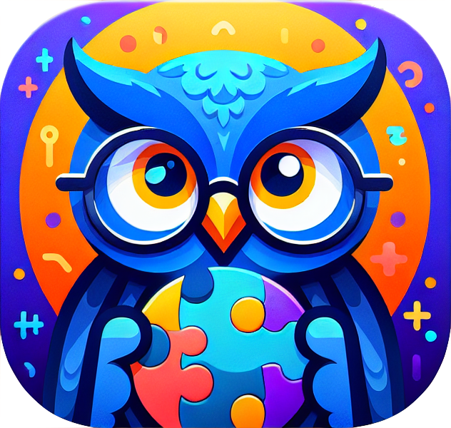

    

<h1 align="center">WORDS SYNCH CHALLENGE</h1>

	<em>Sync Words, a fun benchmark for LLMs!</em>

	
	
	
	

<!-- default option, no dependency badges. -->

	<!-- default option, no dependency badges. -->

 

## 🔗 Table of Contents

- [📍 Overview](#-overview)
- [📚 Publications](#-publications)
- [🎗 License](#-license)
- [🙌 Acknowledgments](#-acknowledgments)

---

## 📍 Overview

The wordssynchchallenge project addresses the challenge of synchronizing word choices between AI models and users in a game-like setting. It offers seamless AI integration, multilingual support, and engaging user interactions. Ideal for AI enthusiasts and developers, it enhances understanding of AI model interactions and natural language processing through interactive gameplay.

---

|      |    Subproject     | Summary                                                                                                                                                                                                                                                                                                                                                       |
| :--- |:-----------------:|:--------------------------------------------------------------------------------------------------------------------------------------------------------------------------------------------------------------------------------------------------------------------------------------------------------------------------------------------------------------|
| ⚙️  |    **Website**    | <ul><li>Utilizes a client-server model with a web application front-end and a backend for game logic and data management.</li><li>Integrates <code>OpenAI</code> and <code>Hugging Face</code> APIs for model interactions, enhancing game interactions</li><li>Database integration via <code>SQLite</code> managed by <code>Sequelize</code> ORM.</li></ul> |
| 🔌 | **Data Analysis** | <ul><li>Dataset creation with <code>OpenAI</code> AI.</li><li>Visualisation via OpenAI embeding and pyplot</li></ul>                                                                                                                                                                                                                                          |

## 📚 Publications

### **2025 (Upcoming)**

- **[Word Synchronization Challenge: A Benchmark for Word Association Responses for Large Language Models](https://hcii2025.springer.com)**  
  *Tanguy Cazalets, Joni Dambre*  
  *Accepted for presentation at HCII 2025 Conference*  
  To be published in Springer’s HCII 2025 Proceedings.  
  This paper introduces the Word Synchronization Challenge, a novel benchmark to evaluate word association responses in Large Language Models (LLMs). It discusses implementation insights, highlights human-LLM interaction mechanisms, and addresses ethical considerations, such as participant consent and data privacy, in studies involving human subjects. 

---

## 🎗 License

This project is protected under the [MIT License ](https://choosealicense.com/licenses/mit/) License.

---

## 🙌 Acknowledgments

- Thanks to Qiao Qiao Ren and Tony Belpaeme for their help on the project.
- This project has received funding from the European Union’s Horizon 2020 research and innovation programme under the Marie Skłodowska-Curie grant agreement No 860949

---
